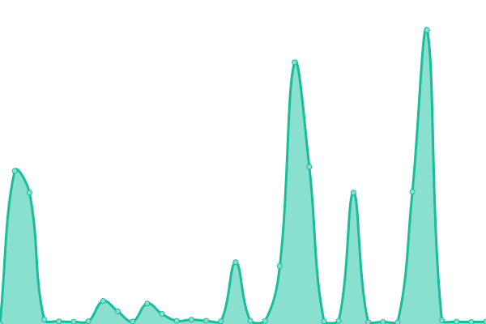

# [📈 Live Status](https://OluwaninsolaAO.github.io/uptime-monitoring): <!--live status--> **🟩 All systems operational**

This repository contains the open-source uptime monitor and status page for [Abraham OLAGUNJU](https://linktr.ee/oluwaninsolaao), powered by [Upptime](https://github.com/upptime/upptime).

With [Upptime](https://upptime.js.org), you can get your own unlimited and free uptime monitor and status page, powered entirely by a GitHub repository. We use [Issues](https://github.com/OluwaninsolaAO/uptime-monitoring/issues) as incident reports, [Actions](https://github.com/OluwaninsolaAO/uptime-monitoring/actions) as uptime monitors, and [Pages](https://OluwaninsolaAO.github.io/uptime-monitoring) for the status page.

<!--start: status pages-->
<!-- This summary is generated by Upptime (https://github.com/upptime/upptime) -->
<!-- Do not edit this manually, your changes will be overwritten -->
<!-- prettier-ignore -->
| URL | Status | History | Response Time | Uptime |
| --- | ------ | ------- | ------------- | ------ |
|  [Helix Biogen Institute - Frontend - Test Staging](https://hbi-web.vercel.app) | 🟩 Up | [helix-biogen-institute-frontend-test-staging.yml](https://github.com/OluwaninsolaAO/uptime-monitoring/commits/HEAD/history/helix-biogen-institute-frontend-test-staging.yml) | 

 155ms
     
 | 

<a href="https://OluwaninsolaAO.github.io/uptime-monitoring/history/helix-biogen-institute-frontend-test-staging">100.00%</a>
    

|  [Helix Biogen Institute - Backend - Test Staging](https://hbi-web.vercel.app/status) | 🟩 Up | [helix-biogen-institute-backend-test-staging.yml](https://github.com/OluwaninsolaAO/uptime-monitoring/commits/HEAD/history/helix-biogen-institute-backend-test-staging.yml) | 

 2846ms
     
 | 

<a href="https://OluwaninsolaAO.github.io/uptime-monitoring/history/helix-biogen-institute-backend-test-staging">98.13%</a>
    

|  [Karlie Portfolio SendMail API](https://sendmail.karliemoyo.tech/status) | 🟩 Up | [karlie-portfolio-send-mail-api.yml](https://github.com/OluwaninsolaAO/uptime-monitoring/commits/HEAD/history/karlie-portfolio-send-mail-api.yml) | 

 2210ms
     
 | 

<a href="https://OluwaninsolaAO.github.io/uptime-monitoring/history/karlie-portfolio-send-mail-api">96.97%</a>
    

|  [Eklessia Bible Quiz API](https://api.eklessia.com/status) | 🟩 Up | [eklessia-bible-quiz-api.yml](https://github.com/OluwaninsolaAO/uptime-monitoring/commits/HEAD/history/eklessia-bible-quiz-api.yml) | 

 4474ms
     
 | 

<a href="https://OluwaninsolaAO.github.io/uptime-monitoring/history/eklessia-bible-quiz-api">96.64%</a>
    

|  [Open Science Community Nigeria - API](https://api.oscnigeria.org/status) | 🟩 Up | [open-science-community-nigeria-api.yml](https://github.com/OluwaninsolaAO/uptime-monitoring/commits/HEAD/history/open-science-community-nigeria-api.yml) | 

 6593ms
     
 | 

<a href="https://OluwaninsolaAO.github.io/uptime-monitoring/history/open-science-community-nigeria-api">96.70%</a>
    

<!--end: status pages-->

[**Visit our status website →**](https://OluwaninsolaAO.github.io/uptime-monitoring)

## 📄 License

- Powered by: [Upptime](https://github.com/upptime/upptime)
- Code: [MIT](./LICENSE) © [Anand Chowdhary](https://anandchowdhary.com), supported by [Pabio](https://pabio.com)
- Data in the `./history` directory: [Open Database License](https://opendatacommons.org/licenses/odbl/1-0/)
